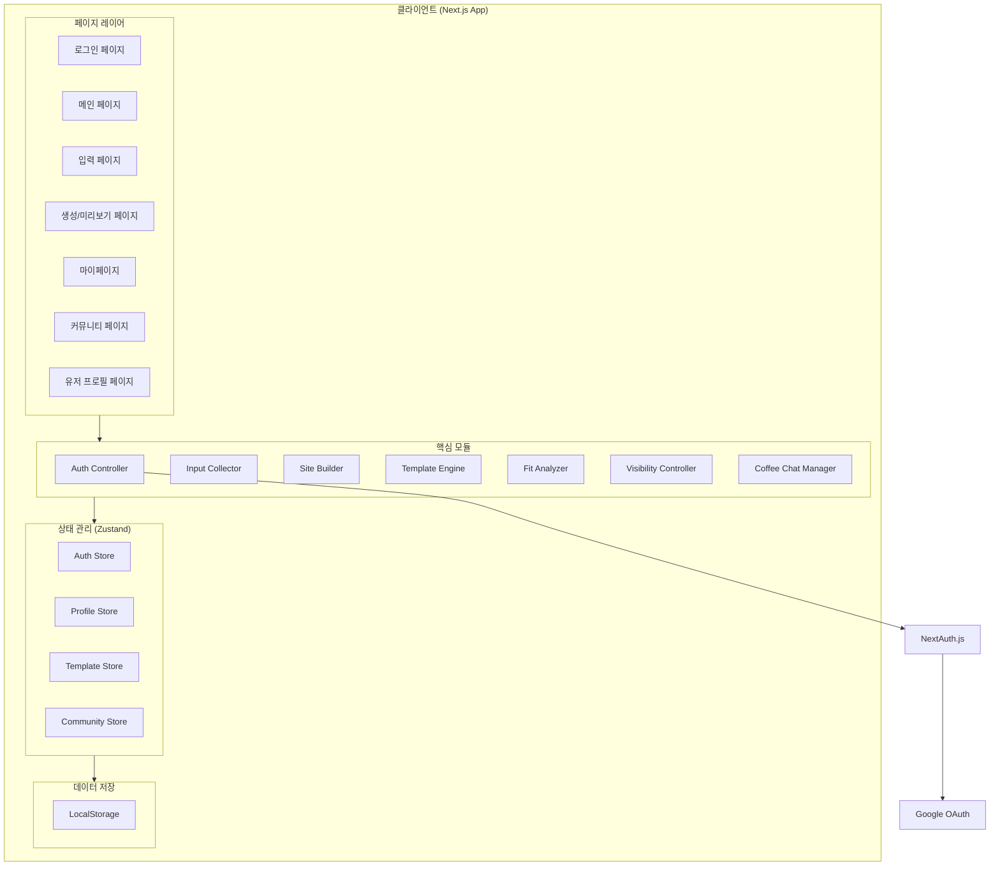
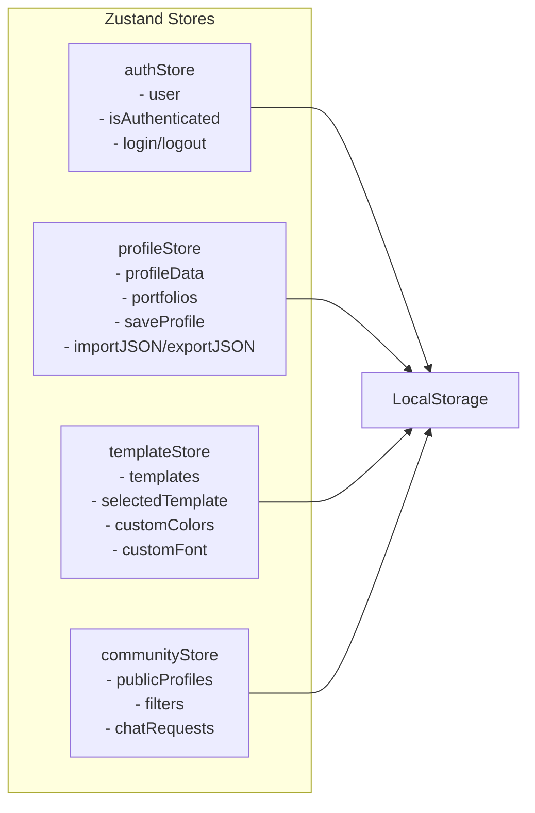
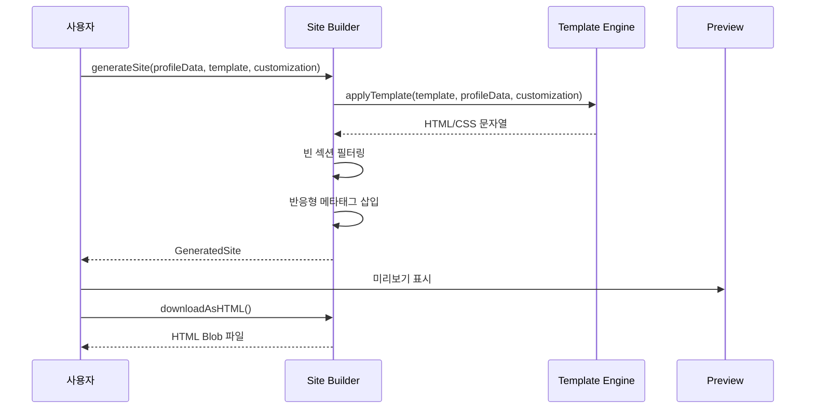

# Design Document: Portfolio Generator (CustomPortfolio: 대신취업해줘)

## Overview

CustomPortfolio는 사용자가 개인 성과물(깃허브, 프로젝트, 경력 등)을 입력하면 자동으로 정적 포트폴리오 웹사이트를 생성하는 프론트엔드 프로토타입 서비스이다. 마스코트 '커폴이(포폴법사)'가 서비스 전반에서 사용자를 친근하게 안내한다.

### 핵심 기능
- 구글 OAuth 소셜 로그인/회원가입
- 포트폴리오 정보 입력 및 검증
- 템플릿 기반 정적 HTML/CSS 사이트 생성
- 기업 인재상 적합도 분석
- 포트폴리오 공개/비공개 설정 및 공유 URL 관리
- 커뮤니티 탐색 및 커피챗 네트워킹
- 데이터 JSON 내보내기/가져오기
- 커폴이 마스코트 기반 UX 가이드

### 기술 스택 선정

| 카테고리 | 선택 | 근거 |
|---------|------|------|
| 프레임워크 | Next.js 14 (App Router) | SSR/SSG 지원, 파일 기반 라우팅, 프론트엔드 프로토타입에 적합 |
| UI 라이브러리 | React 18 | 컴포넌트 기반 아키텍처, 풍부한 생태계 |
| 스타일링 | Tailwind CSS + shadcn/ui | 빠른 프로토타이핑, 일관된 디자인 시스템 |
| 상태 관리 | Zustand | 경량, 보일러플레이트 최소화, TypeScript 친화적 |
| 폼 관리 | React Hook Form + Zod | 선언적 폼 검증, 타입 안전 스키마 검증 |
| 인증 | NextAuth.js (Auth.js) | Google OAuth 간편 통합, 세션 관리 |
| 데이터 저장 | LocalStorage + JSON | 프론트엔드 프로토타입 단계에서 충분, 향후 DB 마이그레이션 용이 |
| 언어 | TypeScript | 타입 안전성, 개발 생산성 |
| 테스트 | Vitest + fast-check | 단위 테스트 및 프로퍼티 기반 테스트 |

### 설계 방향

현재 단계에서는 백엔드 없이 프론트엔드 프로토타입으로 구현하므로:
- 데이터는 LocalStorage에 저장 (향후 DB 연동 시 데이터 레이어만 교체)
- 인증은 NextAuth.js로 세션 관리 (프로토타입에서는 mock 가능)
- 사이트 생성은 클라이언트 사이드에서 HTML 문자열 조립
- 적합도 분석은 순수 함수로 클라이언트에서 계산

## Architecture

### 시스템 아키텍처



### 라우팅 구조

```
/                       → 로그인/랜딩 페이지
/main                   → 메인 페이지 (네비게이션 허브)
/portfolio/create       → 포트폴리오 생성 (입력 → 템플릿 → 생성)
/portfolio/preview/:id  → 생성된 포트폴리오 미리보기
/portfolio/view/:id     → 공개 포트폴리오 열람 (외부 접근 가능)
/mypage                 → 마이페이지 (포트폴리오 관리, 커피챗 대시보드)
/mypage/fit-analysis    → 적합도 분석
/community              → 커뮤니티 (공개 프로필 탐색)
/community/user/:id     → 유저 프로필 페이지
```

### 상태 관리 아키텍처



## Components and Interfaces

### 페이지 컴포넌트

```typescript
// 페이지 컴포넌트 구조
/app
  /page.tsx                    // 로그인 페이지
  /main/page.tsx               // 메인 페이지
  /portfolio
    /create/page.tsx           // 포트폴리오 생성 (스텝 위저드)
    /preview/[id]/page.tsx     // 미리보기
    /view/[id]/page.tsx        // 공개 열람
  /mypage
    /page.tsx                  // 마이페이지
    /fit-analysis/page.tsx     // 적합도 분석
  /community
    /page.tsx                  // 커뮤니티
    /user/[id]/page.tsx        // 유저 프로필
```

### 핵심 모듈 인터페이스

```typescript
// Auth Controller
interface AuthController {
  loginWithGoogle(): Promise<void>;
  logout(): Promise<void>;
  getSession(): UserSession | null;
  isAuthenticated(): boolean;
}

// Input Collector
interface InputCollector {
  validateField(field: string, value: unknown): ValidationResult;
  saveProfileData(data: ProfileData): void;
  exportToJSON(data: ProfileData): string;
  importFromJSON(json: string): ProfileData | ValidationError;
}

// Site Builder
interface SiteBuilder {
  generateSite(profile: ProfileData, template: Template, customization: Customization): GeneratedSite;
  getPreviewHTML(site: GeneratedSite): string;
  downloadAsHTML(site: GeneratedSite): Blob;
}

// Template Engine
interface TemplateEngine {
  getTemplates(): Template[];
  applyTemplate(template: Template, data: ProfileData, customization: Customization): string;
  getPreview(template: Template, data: ProfileData, customization: Customization): string;
}

// Fit Analyzer
interface FitAnalyzer {
  analyze(profile: ProfileData, criteria: CompanyCriteria): FitReport;
  calculateTechMatchRate(userSkills: string[], requiredSkills: string[]): number;
  calculateOverallScore(profile: ProfileData, criteria: CompanyCriteria): number;
  generateSuggestions(report: FitReport): string[];
}

// Visibility Controller
interface VisibilityController {
  setVisibility(portfolioId: string, visibility: 'public' | 'private'): void;
  getVisibility(portfolioId: string): 'public' | 'private';
  generateShareURL(portfolioId: string): string;
  canAccess(portfolioId: string, userId: string | null): boolean;
}

// Coffee Chat Manager
interface CoffeeChatManager {
  sendRequest(request: ChatRequest): void;
  getReceivedRequests(userId: string): ChatRequest[];
  respondToRequest(requestId: string, response: 'accept' | 'reject'): void;
}
```

### UI 공통 컴포넌트

```typescript
// 마스코트 메시지 컴포넌트
interface MascotMessageProps {
  type: 'guide' | 'loading' | 'success' | 'error' | 'welcome';
  message: string;
  illustration?: 'magic' | 'celebrate' | 'confused' | 'wave';
}

// 네비게이션 컴포넌트
interface NavigationProps {
  activeMenu: 'create' | 'mypage' | 'community';
  user: UserSession;
}

// 폼 필드 컴포넌트
interface FormFieldProps {
  label: string;
  name: string;
  type: 'text' | 'email' | 'url' | 'textarea' | 'tags';
  validation?: ZodSchema;
  maxLength?: number;
  error?: string;
}
```

### Site Builder 생성 로직



## Data Models

```typescript
// 사용자 세션
interface UserSession {
  id: string;
  name: string;
  email: string;
  profileImage: string;
  isFirstLogin: boolean;
}

// 프로필 데이터
interface ProfileData {
  id: string;
  userId: string;
  name: string;                    // 필수, 최대 50자
  title: string;                   // 직함, 최대 50자
  bio: string;                     // 자기소개, 최대 500자
  email: string;                   // 연락처 이메일
  skills: string[];                // 기술 스택 태그, 최대 30개
  githubUrl: string;               // 깃허브 프로필 URL
  projects: Project[];             // 프로젝트 목록, 최대 20개
  experiences: Experience[];       // 경력 목록, 최대 20개
  createdAt: string;               // ISO 8601
  updatedAt: string;               // ISO 8601
}

// 프로젝트
interface Project {
  id: string;
  title: string;                   // 최대 100자
  description: string;             // 최대 1000자
  url: string;
  technologies: string[];
}

// 경력
interface Experience {
  id: string;
  company: string;                 // 최대 50자
  position: string;                // 최대 50자
  startDate: string;               // YYYY-MM
  endDate: string;                 // YYYY-MM 또는 'present'
  description: string;             // 최대 1000자
}

// 템플릿
interface Template {
  id: string;
  name: string;
  thumbnail: string;
  htmlTemplate: string;
  cssTemplate: string;
}

// 커스터마이징 설정
interface Customization {
  primaryColor: string;            // HEX 색상코드
  secondaryColor: string;          // HEX 색상코드
  fontFamily: 'serif' | 'sans-serif' | 'monospace';
}

// 생성된 사이트
interface GeneratedSite {
  id: string;
  portfolioId: string;
  html: string;
  css: string;
  generatedAt: string;
  templateId: string;
  customization: Customization;
}

// 기업 인재상 기준
interface CompanyCriteria {
  requiredSkills: string[];        // 필수: 1개 이상
  minExperienceYears: number;
  preferredRole: string;
  additionalRequirements: string;
}

// 적합도 분석 결과
interface FitReport {
  techMatchRate: number;           // 0~100
  missingSkills: string[];
  experienceMet: boolean;
  overallScore: number;            // 0~100
  suggestions: string[];
}

// 포트폴리오 메타 정보
interface PortfolioMeta {
  id: string;
  userId: string;
  profileDataId: string;
  visibility: 'public' | 'private';
  shareUrl: string;
  generatedSiteId: string;
  createdAt: string;
  updatedAt: string;
}

// 커피챗 요청
interface ChatRequest {
  id: string;
  fromUserId: string;
  toUserId: string;
  requesterName: string;           // 필수
  requesterEmail: string;          // 필수
  requesterOrganization: string;
  message: string;                 // 필수, 최대 500자
  status: 'pending' | 'accepted' | 'rejected';
  createdAt: string;
  respondedAt?: string;
}

// 커뮤니티 필터
interface CommunityFilter {
  role?: string;                   // 직함 필터
  company?: string;                // 소속 기업 필터
  skill?: string;                  // 기술 스택 필터
  page: number;
  pageSize: 12;
}

// 공개 프로필 카드
interface PublicProfileCard {
  userId: string;
  name: string;
  title: string;
  profileImage: string;
  skills: string[];
  portfolioCount: number;
}
```

### LocalStorage 스키마

```typescript
// LocalStorage 키 구조
const STORAGE_KEYS = {
  AUTH_SESSION: 'cupol_auth_session',
  PROFILE_DATA: 'cupol_profile_data',
  PORTFOLIOS: 'cupol_portfolios',
  PORTFOLIO_META: 'cupol_portfolio_meta',
  TEMPLATES_CUSTOMIZATION: 'cupol_template_custom',
  CHAT_REQUESTS: 'cupol_chat_requests',
  COMMUNITY_PROFILES: 'cupol_community_profiles',
  ONBOARDING_SHOWN: 'cupol_onboarding_shown',
} as const;
```

## Correctness Properties

*속성(Property)이란 시스템의 모든 유효한 실행에서 참이어야 하는 특성 또는 행동을 의미합니다. 속성은 인간이 읽을 수 있는 명세와 기계가 검증할 수 있는 정확성 보장 사이의 다리 역할을 합니다.*

### Property 1: ProfileData JSON 직렬화 라운드트립

*For any* 유효한 ProfileData 객체에 대해, JSON으로 내보내기(export)한 후 가져오기(import)하면 원본 ProfileData와 동일한 객체가 복원되어야 한다.

**Validates: Requirements 9.1, 9.2, 9.3**

### Property 2: 잘못된 JSON 가져오기 시 상태 보존

*For any* 유효하지 않은 JSON 문자열(구문 오류 또는 필수 필드 누락)에 대해, 가져오기를 시도하면 오류를 반환하고 기존 ProfileData를 변경하지 않아야 한다.

**Validates: Requirements 9.4, 9.5, 9.6**

### Property 3: 기술 스택 일치율 계산 정확성

*For any* 사용자 기술 스택 집합과 요구 기술 스택 집합에 대해, calculateTechMatchRate의 결과는 (교집합 크기 / 요구 기술 크기) × 100과 동일하며, 항상 0~100 범위 내에 있어야 한다.

**Validates: Requirements 6.3**

### Property 4: 부족 기술 스택 = 집합 차이

*For any* 사용자 기술 스택 집합 S와 요구 기술 스택 집합 R에 대해, 부족 기술 목록은 정확히 R - S (요구에는 있으나 사용자에게는 없는 기술)와 동일해야 한다.

**Validates: Requirements 6.4**

### Property 5: 경력 요구사항 충족 판정

*For any* 사용자 경력 목록과 최소 요구 경력 연수에 대해, 사용자의 총 경력 기간(년)이 최소 요구 연수 이상이면 '충족', 미만이면 '미충족'을 반환해야 한다.

**Validates: Requirements 6.5**

### Property 6: 전체 적합도 점수 범위

*For any* 유효한 ProfileData와 CompanyCriteria에 대해, calculateOverallScore의 결과는 항상 0~100 범위 내의 숫자여야 한다.

**Validates: Requirements 6.6**

### Property 7: 개선 제안 최소 1개 보장

*For any* FitReport에 대해, generateSuggestions의 결과 배열은 항상 1개 이상의 항목을 포함해야 한다.

**Validates: Requirements 6.7**

### Property 8: 포트폴리오 접근 제어 규칙

*For any* 포트폴리오와 접근 시도 사용자에 대해, canAccess는 해당 포트폴리오의 visibility가 'public'이거나 접근 사용자가 소유자인 경우에만 true를 반환해야 한다.

**Validates: Requirements 7.3, 7.6, 7.7**

### Property 9: 사이트 생성 시 빈 섹션 생략

*For any* ProfileData에 대해, 값이 비어있는 필드(빈 배열, 빈 문자열)에 해당하는 섹션은 생성된 HTML에 포함되지 않아야 하며, 값이 있는 필드의 섹션은 반드시 포함되어야 한다.

**Validates: Requirements 4.3**

### Property 10: 생성된 사이트 반응형 메타태그 포함

*For any* 유효한 ProfileData와 템플릿 조합에 대해, generateSite의 결과 HTML은 viewport 메타태그와 반응형 CSS를 포함해야 한다.

**Validates: Requirements 4.2**

### Property 11: 커스터마이징 반영

*For any* 유효한 Customization(primaryColor, secondaryColor, fontFamily)에 대해, 생성된 사이트의 CSS는 해당 색상값과 폰트 패밀리를 포함해야 한다.

**Validates: Requirements 5.6**

### Property 12: URL 검증 정확성

*For any* 문자열에 대해, 해당 문자열이 http:// 또는 https://로 시작하는 유효한 URL 형식이면 validateField('url', value)는 성공을 반환하고, 그렇지 않으면 실패를 반환해야 한다.

**Validates: Requirements 10.1**

### Property 13: 이메일 검증 정확성

*For any* 문자열에 대해, 해당 문자열이 "local@domain.tld" 구조를 충족하는 유효한 이메일이면 validateField('email', value)는 성공을 반환하고, 그렇지 않으면 실패를 반환해야 한다.

**Validates: Requirements 10.2**

### Property 14: 색상값 검증

*For any* 문자열에 대해, 해당 문자열이 유효한 HEX 색상코드(#RRGGBB 형식)이면 검증 통과, 그렇지 않으면 검증 실패를 반환해야 한다.

**Validates: Requirements 5.7**

### Property 15: 커뮤니티 필터 정확성

*For any* 공개 프로필 목록과 필터 조건(직무, 기업, 기술 스택)에 대해, 필터 적용 결과는 해당 조건을 만족하는 프로필만 포함해야 한다.

**Validates: Requirements 8.2, 8.3, 8.4**

### Property 16: 페이지네이션 크기 제한

*For any* 크기의 공개 프로필 목록에 대해, 한 페이지의 결과는 최대 12개를 초과하지 않아야 한다.

**Validates: Requirements 8.1**

### Property 17: 커피챗 버튼 표시 규칙

*For any* 로그인한 사용자와 User_Profile_Page 소유자에 대해, 커피챗 요청 버튼은 방문자 ID ≠ 소유자 ID인 경우에만 표시되어야 한다.

**Validates: Requirements 8.9, 8.10**

### Property 18: 필수 필드 미입력 시 제출 차단

*For any* ChatRequest에서 필수 필드(이름, 이메일, 메시지) 중 하나라도 빈 문자열이거나 공백만으로 구성된 경우, 폼 제출은 차단되어야 한다.

**Validates: Requirements 8.12**

### Property 19: 깃허브 URL 조건부 렌더링

*For any* ProfileData에서 githubUrl이 비어있지 않은 경우, 생성된 HTML에 해당 URL이 클릭 가능한 하이퍼링크로 포함되어야 한다.

**Validates: Requirements 4.6**

### Property 20: 이름 필수 필드 검증

*For any* 이름 필드가 빈 문자열이거나 공백만으로 구성된 ProfileData에 대해, 저장(submit)은 차단되어야 한다.

**Validates: Requirements 3.6**

## Error Handling

### 에러 분류 및 처리 전략

| 에러 유형 | 발생 지점 | 처리 방식 | 사용자 안내 |
|-----------|-----------|-----------|-------------|
| 인증 실패 | OAuth 콜백 | 로그인 페이지 유지 | 커폴이 오류 메시지 + 재시도 |
| 네트워크 오류 | OAuth, API 호출 | 현재 상태 유지 | 커폴이 "마법이 꼬였어요" + 재시도 버튼 |
| 폼 검증 실패 | Input_Collector | 제출 차단, 필드 강조 | 커폴이 "여기를 확인해볼래요?" |
| 사이트 생성 실패 | Site_Builder | 로딩 제거, 입력 데이터 보존 | 커폴이 오류 메시지 + 재시도 |
| JSON 가져오기 실패 | Import | 기존 데이터 유지 | 오류 원인 안내 메시지 |
| 비인가 접근 | Visibility_Controller | 비공개 안내 페이지 표시 | "비공개 포트폴리오입니다" |
| LocalStorage 용량 초과 | 데이터 저장 | 저장 실패 알림 | 오래된 데이터 정리 안내 |

### 에러 처리 원칙

1. **데이터 보존 우선**: 어떤 에러가 발생해도 사용자가 입력한 데이터는 손실되지 않아야 한다
2. **친근한 안내**: 모든 에러 메시지는 커폴이 마스코트와 함께 친근한 톤으로 전달
3. **복구 경로 제공**: 가능한 경우 재시도 버튼 또는 대안 동작을 제공
4. **Graceful Degradation**: LocalStorage 접근 불가 시 인메모리 상태로 폴백

### 에러 바운더리 구조

```typescript
// 전역 에러 바운더리
class AppErrorBoundary {
  handleError(error: Error): void {
    // 에러 타입에 따라 적절한 커폴이 메시지 표시
    // 복구 가능한 에러: 재시도 옵션 제공
    // 치명적 에러: 새로고침 안내
  }
}

// 모듈별 에러 처리
type AppError = 
  | { type: 'VALIDATION_ERROR'; field: string; message: string }
  | { type: 'AUTH_ERROR'; reason: 'cancelled' | 'failed' | 'network' }
  | { type: 'GENERATION_ERROR'; details: string }
  | { type: 'IMPORT_ERROR'; reason: 'invalid_json' | 'missing_fields' }
  | { type: 'STORAGE_ERROR'; reason: 'quota_exceeded' | 'unavailable' }
  | { type: 'ACCESS_DENIED'; portfolioId: string };
```

## Testing Strategy

### 테스트 프레임워크

- **단위 테스트**: Vitest
- **프로퍼티 기반 테스트**: fast-check (Vitest 통합)
- **컴포넌트 테스트**: React Testing Library
- **E2E 테스트**: (향후 확장 시 Playwright)

### 듀얼 테스트 접근법

**단위 테스트 (Example-based)**:
- 인증 흐름 (mock OAuth)
- UI 컴포넌트 렌더링 (네비게이션, 폼, 마스코트)
- 특정 에지 케이스 (최대 태그 수, 최대 프로젝트 수)
- 에러 핸들링 시나리오
- 라우팅 가드 (인증 리다이렉트)

**프로퍼티 기반 테스트 (Property-based)**:
- 프레임워크: fast-check
- 최소 반복 횟수: 100회
- 각 테스트에 설계 문서 속성 참조 태그 포함
- 태그 형식: `Feature: portfolio-generator, Property {N}: {description}`

### PBT 대상 모듈

| 모듈 | 속성 | 핵심 근거 |
|------|------|-----------|
| Input_Collector (JSON 직렬화) | Property 1, 2 | 라운드트립 검증, 순수 함수 |
| Fit_Analyzer | Property 3, 4, 5, 6, 7 | 순수 계산 함수, 다양한 입력 |
| Visibility_Controller | Property 8 | 접근 제어 규칙, 보안 중요 |
| Site_Builder | Property 9, 10, 11, 19 | 생성 로직, 다양한 데이터 조합 |
| Validation 유틸리티 | Property 12, 13, 14, 20 | 순수 검증 함수, 넓은 입력 공간 |
| Community 필터 | Property 15, 16 | 데이터 필터링, 순수 함수 |
| Coffee Chat UI 로직 | Property 17, 18 | 조건부 규칙, 보안 관련 |

### 테스트 파일 구조

```
/tests
  /unit
    auth.test.ts
    navigation.test.ts
    mascot.test.ts
    form-fields.test.ts
  /properties
    serialization.property.test.ts    // Property 1, 2
    fit-analyzer.property.test.ts     // Property 3, 4, 5, 6, 7
    visibility.property.test.ts       // Property 8
    site-builder.property.test.ts     // Property 9, 10, 11, 19
    validation.property.test.ts       // Property 12, 13, 14, 20
    community.property.test.ts        // Property 15, 16, 17, 18
  /integration
    portfolio-flow.test.ts
    community-flow.test.ts
```

